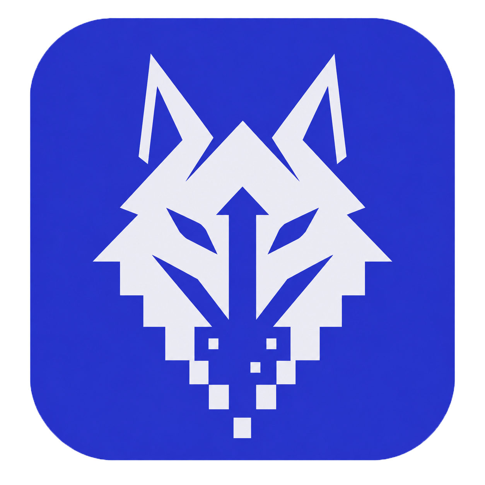

<p align="center"></p>

<h1 align="center">Borasuki</h1>

<p align="center">A focused Windows desktop app for 2× upscaling anime and animation videos.</p>

<p align="center"><code>Windows 10/11</code> · <code>NVIDIA GPU</code> · <code>TensorRT</code> · <code>Public beta</code></p>

<p align="center">
  <a href="https://github.com/huseyincancalti/Borasuki/releases/download/v1.0.0-beta.3/Borasuki-Setup-1.0.0-beta.3-win64.exe"><strong>Download for Windows</strong></a>
  · <a href="#system-requirements">Check requirements</a>
  · <a href="#quick-start">Get started</a>
</p>

Borasuki is for people processing anime or other animated footage who want to create a 2× video, inspect a short before/after preview, and manage jobs in one place. Optional denoise and conservative color controls can improve a source, but they cannot restore detail that was never present. Results vary by video.

## Key features

- **2× upscaling:** Real-CUGAN inference through TensorRT FP16 on a compatible NVIDIA GPU.
- **Independent controls:** optional denoise with three levels; Adaptive, Reference, Original, and manual color modes. Adaptive selects one grade for the whole video.
- **Preview and queue:** compare a short original/processed section before committing, add one or multiple videos, and manage jobs with state-appropriate pause, resume, retry, and cancel actions.
- **MP4 or MKV output:** HEVC Main10 hardware encoding. MP4 warns before dropping incompatible subtitles or attachments; incompatible audio is not silently discarded.
- **Update notifications:** background checks on startup and a manual check in Settings. Open the release page when you choose; updates are never installed automatically.

## Download

**Latest public beta:** [Borasuki 1.0.0 beta 3](https://github.com/huseyincancalti/Borasuki/releases/tag/v1.0.0-beta.3) · [Windows installer](https://github.com/huseyincancalti/Borasuki/releases/download/v1.0.0-beta.3/Borasuki-Setup-1.0.0-beta.3-win64.exe)

Beta 3 fixes MP4 output on legacy FFmpeg runtimes and adds update checks and a mandatory installed-artifact release gate. Close Borasuki and install beta 3 over beta 1/2; local settings and history are preserved. Older versions do not have the update checker, so this first upgrade is manual.

The installer is about 30 MB. First-time in-app setup downloads approximately 3 GB of processing components directly from their publishers and checks pinned SHA-256 hashes. Interrupted downloads can resume. This is a **pre-release for testing**, not a stable 1.0 release.

The installer is not code-signed, so Windows may show a reputation warning. Its SHA-256 is listed on the [release page](https://github.com/huseyincancalti/Borasuki/releases/tag/v1.0.0-beta.3).

## System requirements

| Required | Details |
| --- | --- |
| Operating system | Windows 10 or 11, x64 |
| Graphics | Compatible NVIDIA GPU and driver; no CPU fallback |
| Storage | At least 7 GB free for initial setup |
| Network | Internet connection for first-time downloads |

This beta was tested on Windows 11 with an RTX 3050 Laptop GPU (4 GB VRAM). That is a **tested configuration, not a minimum GPU specification**. Other hardware has not been broadly validated. The installer adds Microsoft WebView2 if it is missing.

## Quick start

1. Download and run the [installer](https://github.com/huseyincancalti/Borasuki/releases/download/v1.0.0-beta.3/Borasuki-Setup-1.0.0-beta.3-win64.exe).
2. Open Borasuki and complete the in-app processing setup.
3. Add a video, choose denoise and color settings, an output folder, and MP4 or MKV.
4. Let the selected TensorRT engine prepare, then preview a short section or add the job to the queue. A new video/GPU/settings combination may take several minutes to prepare.

## How it works

`FFMS2 decode → VapourSynth + Real-CUGAN → TensorRT FP16 → FFmpeg + NVIDIA NVENC output`

The local WebView2 interface talks to a Python service. SQLite stores jobs and presets; rendering uses recoverable segments. Adaptive color analyzes samples and applies one conservative grade across the video, not scene-by-scene correction.

## Local data and privacy

Source videos stay where you put them; outputs go to your chosen folder. History, settings, logs, packages, and caches remain on your computer under `%LOCALAPPDATA%\KaraKedi\Borasuki`. A fresh installation starts empty, and uninstalling leaves your own app data in place. Borasuki does not automatically upload videos, job history, or diagnostics; you decide whether to share diagnostic files.

On startup, the update checker requests the public GitHub release list. This sends no video paths, settings, history or diagnostics. GitHub receives a normal HTTPS request (including your IP address); a failed check does not block processing.

## Known limitations

- Input must be compatible SDR, progressive, constant-frame-rate video. HDR, interlaced, and variable-frame-rate sources are not supported in this beta.
- Visual gains depend on the source; upscaling and denoise can also soften fine detail. Check a preview before a long job.
- Adaptive color is video-wide, not scene-aware. First-time engine preparation can be slow.
- Clean-install behavior and GPU compatibility have been tested on a limited set of systems.
- Update checks need internet access and can fail because of connectivity or GitHub rate limits. Manual checking is available in Settings.

## Run from source

With Python 3.13 on Windows:

```powershell
py -3.13 -m pip install -e .
py -3.13 main.py
```

Complete the in-app processing setup before running a job. The Windows packaging entry point is [`installer/build.ps1`](installer/build.ps1). See [release validation](docs/RELEASE_VALIDATION.md) for the required tests and fail-closed publishing workflow.

## Third-party components and license

Borasuki's source is available under the [MIT License](LICENSE). Downloaded processing components have their own licenses and terms; see [Third-party notices](THIRD_PARTY_NOTICES.md).

---

Hüseyin Can ÇALTI · [karakedidub.com](https://karakedidub.com) · [hsyncalti2@gmail.com](mailto:hsyncalti2@gmail.com)
